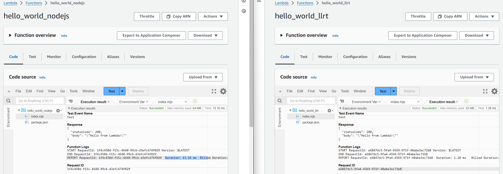
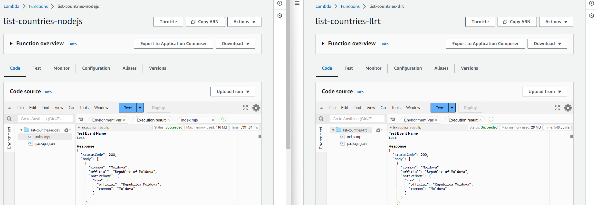
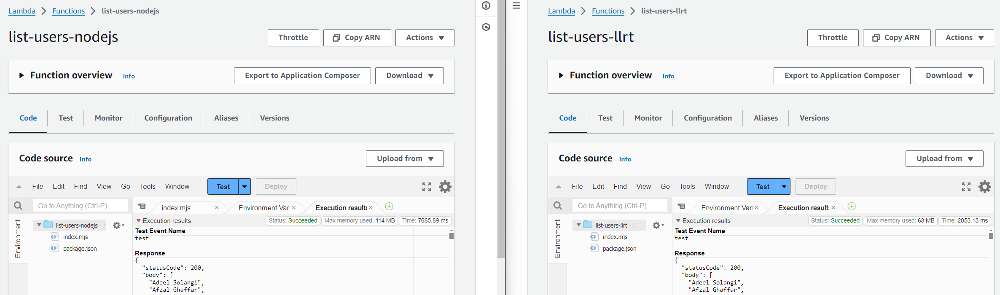
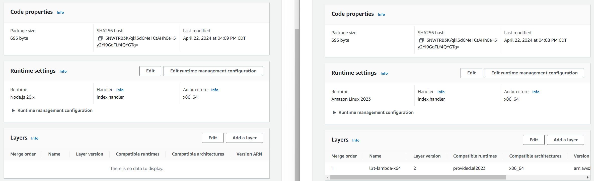

# Hello World

| NodeJS                   | LLRT                    |
|--------------------------|-------------------------|
| Duration: 13.16 ms       | Duration: 1.28 ms       |
| Billed Duration: 14 ms   | Billed Duration: 38 ms  |
| Memory Size: 128 MB      | Memory Size: 128 MB     |
| Max Memory Used: 64 MB   | Max Memory Used: 23 MB  |
| Init Duration: 142.35 ms | Init Duration: 35.84 ms |

# List all countries

| NodeJS                   | LLRT                    |
|--------------------------|-------------------------|
| Duration: 5391.81 ms     | Duration: 546.85 ms     |
| Billed Duration: 5392 ms | Billed Duration: 576 ms |
| Memory Size: 128 MB      | Memory Size: 128 MB     |
| Max Memory Used: 116 MB  | Max Memory Used: 29 MB  |
| Init Duration: 149.29 ms | Init Duration: 28.80 ms |

# List all users

| NodeJS                   | LLRT                     |
|--------------------------|--------------------------|
| Duration: 7665.89 ms     | Duration: 2053.13 ms     |
| Billed Duration: 7666 ms | Billed Duration: 2094 ms |
| Memory Size: 128 MB      | Memory Size: 128 MB      |
| Max Memory Used: 114 MB  | Max Memory Used: 63 MB   |
| Init Duration: 139.70 ms | Init Duration: 40.14 ms  |

# Runtimes

